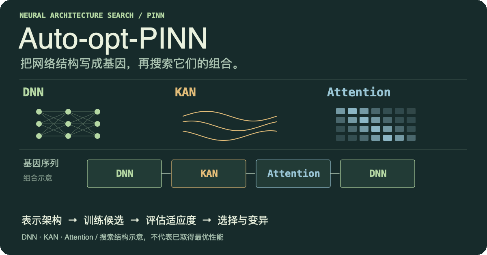

<p align="center">
  
</p>

# Auto-opt-PINN

使用遗传算法搜索 DNN、KAN 与 Attention 的混合 PINN 架构，并在 Burgers 方程相关实验中记录候选结构和训练结果。

## 工作方式

**表示架构 → 训练候选 → 评估适应度 → 选择与变异 → 保存结果**。

头图展示的是架构搜索的组成与顺序，不代表某个候选已经取得最优性能。

## 开始一次搜索

```bash
python -m venv .venv
source .venv/bin/activate
python -m pip install -r requirements.txt
cd src
python main.py
```

`src/main.py` 使用 `auto_pinn/config.py` 中的默认配置，完成搜索后把适应度和架构基因写入当前工作目录的 `search_results.json`。

## 核心代码

| 文件 | 作用 |
| --- | --- |
| [`src/auto_pinn/gene.py`](src/auto_pinn/gene.py) | 架构基因表示 |
| [`src/auto_pinn/genetic_algorithm.py`](src/auto_pinn/genetic_algorithm.py) | 遗传搜索流程 |
| [`src/auto_pinn/pinn.py`](src/auto_pinn/pinn.py) | 混合 PINN 模型 |
| [`src/auto_pinn/trainer.py`](src/auto_pinn/trainer.py) | 训练与适应度评估 |
| [`src/auto_pinn/config.py`](src/auto_pinn/config.py) | 搜索与训练配置 |

## 查看已有材料

- [实现说明](src/README.md)
- [架构比较脚本](src/compare_architectures.py)
- [检查点分析脚本](src/analyze_checkpoints.py)
- [已保存实验输出](Kaggle_Output/)

具体结论应结合对应配置和运行记录阅读。许可证见 [`LICENSE`](LICENSE)。

<details>
<summary>Static overview</summary>

[Open the static SVG](./assets/readme/hero.svg).

</details>
